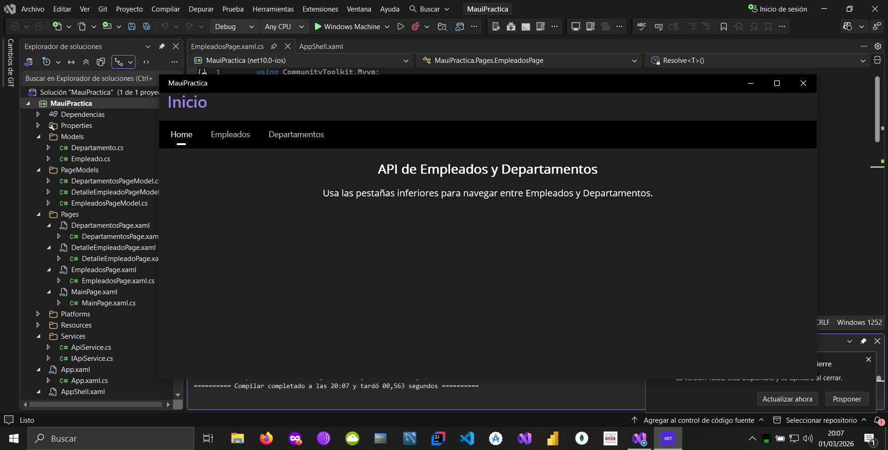

# DdI-netMaui-app
Aplicación multiplataforma realizada con .NET MAUI en Visual Studio 2026 para consultar el directorio de empleados y departamentos de una API REST hecha en FastAPI.

---

## Descripción del proyecto
Este proyecto forma parte de las prácticas de las asignaturas Desarrollo de Interfaces (DI) y Sistemas de Gestión Empresarial (SGE).
La aplicación permite visualizar información de empleados y departamentos obtenida desde una API creada con FastAPI, mostrando los datos mediante una interfaz multiplataforma compatible con Windows, Android y otros dispositivos soportados por MAUI.

---

## Funcionalidades principales
- Consulta de empleados.
- Consulta de departamentos.
- Navegación entre pantallas mediante Shell.
- Arquitectura MVVM (PageModels).
- Consumo de API REST mediante servicios HTTP.
- Interfaz adaptada a escritorio y móvil.
- Gestión de estados y actualización de datos en tiempo real desde la API.

---

## Tecnologías utilizadas
- .NET MAUI
- C#
- XAML
- MVVM (Model–View–ViewModel)
- HttpClient para consumo de API
- FastAPI como backend
- JSON para intercambio de datos
- Visual Studio 2026

---

## Instalación y ejecución
- Clonar el repositorio: git clone https://github.com/DAM-Fran/Ddl-netMaui-app
- Abrir el archivo de solución: MauiPractica.slnx
- Configurar la URL del backend FastAPI en el servicio correspondiente (si aplica).
- Seleccionar plataforma de ejecución (Windows, Android…).
- Ejecutar desde Visual Studio.

---

## Screenshot de la aplicación en pantalla



---

## Estructura básica del proyecto
```
MauiPractica/
│
├── Models/          → Clases de datos
├── PageModels/      → Lógica de presentación (MVVM)
├── Pages/           → Vistas XAML
├── Services/        → Acceso a la API REST
├── Resources/       → Estilos, imágenes, fuentes…
├── Platforms/       → Código específico por plataforma
├── Properties/      → Configuración del proyecto
│
├── App.xaml         → Estilos globales
├── AppShell.xaml    → Navegación
├── MainPage.xaml    → Página principal
├── MauiProgram.cs   → Configuración de la app
└── MauiPractica.csproj
```

---

## Licencia
Proyecto académico desarrollado para la asignatura de **Desarrollo de Interfaces (DI)**.

---

## Autor
**Franco Cayo**
alumno de 2º de Desarrollo de Aplicaciones Multiplataforma - Curso 2025/2026
